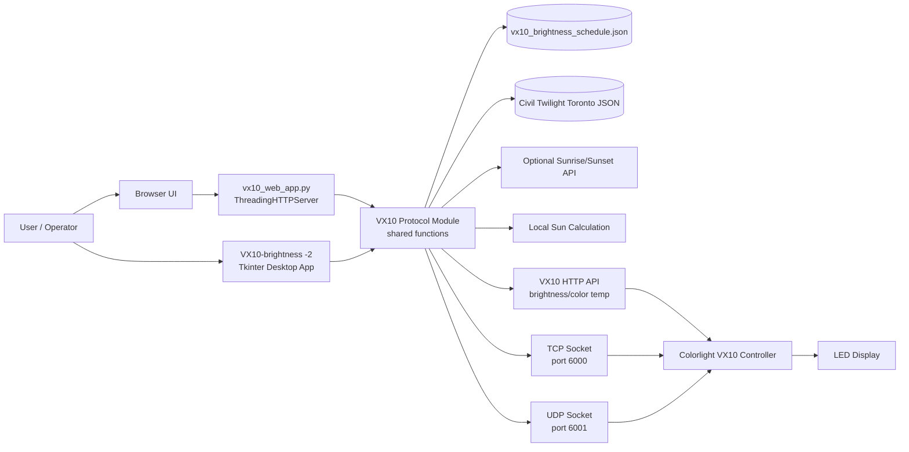
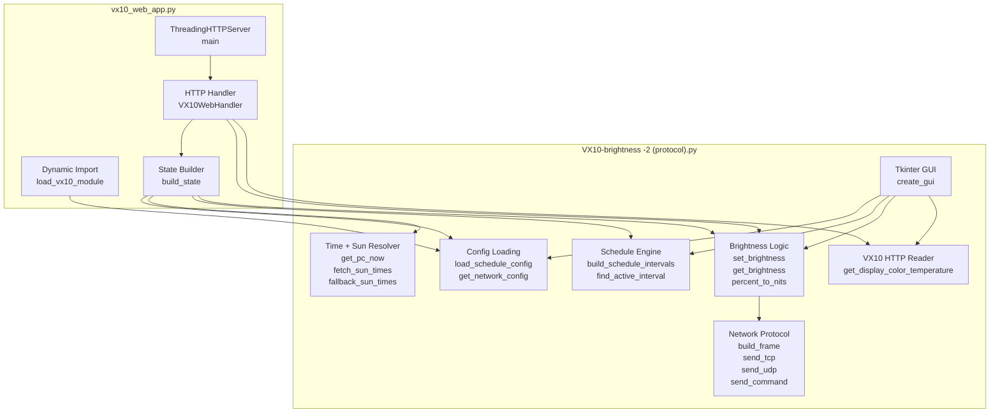
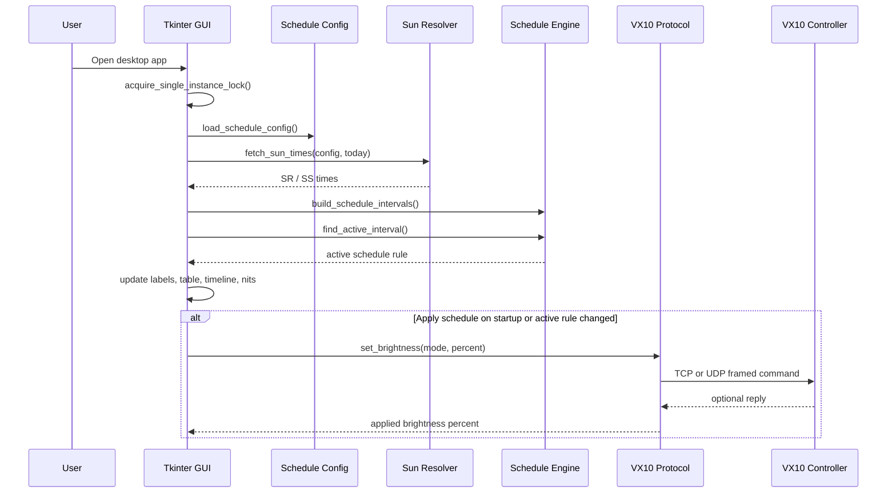
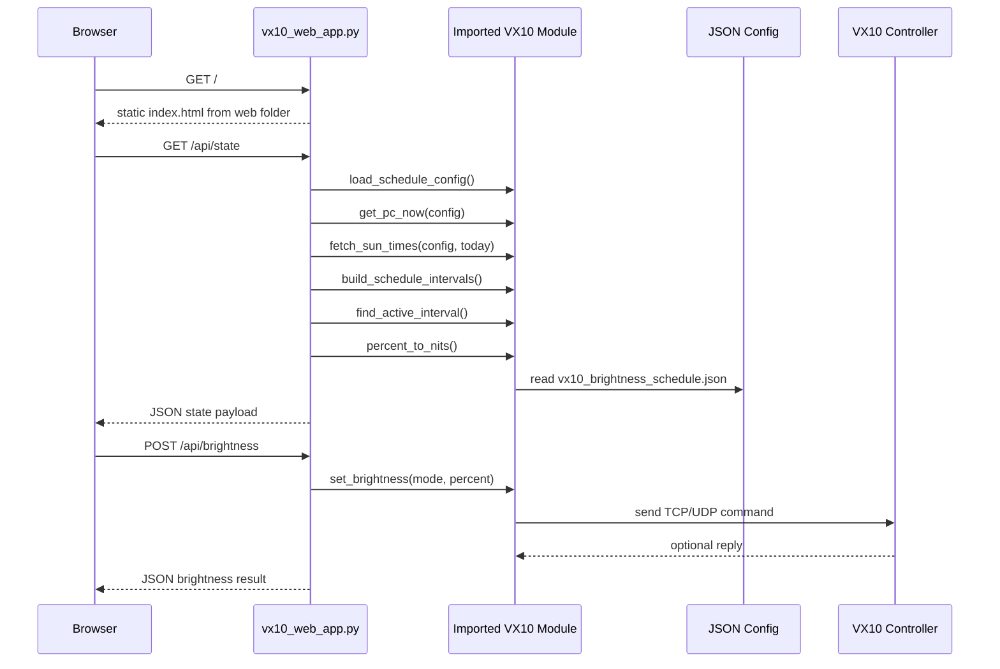
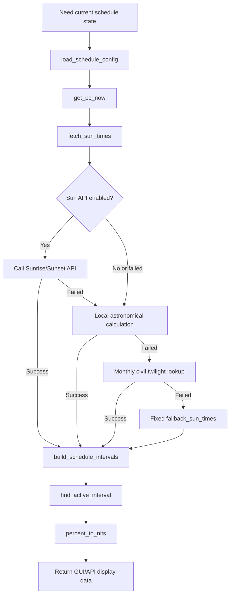
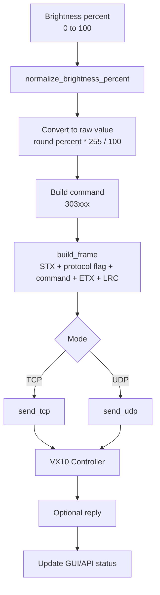
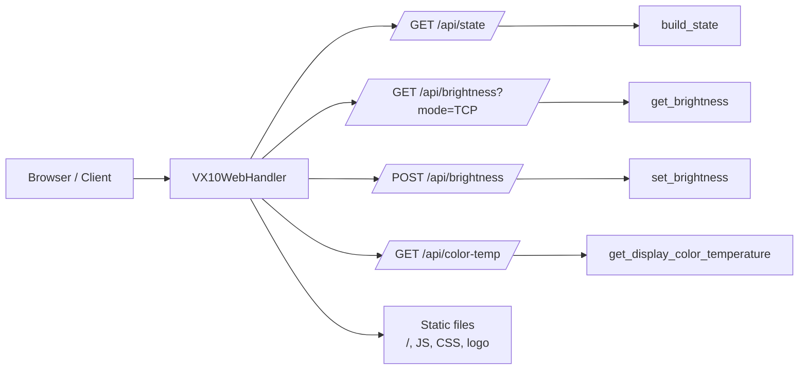
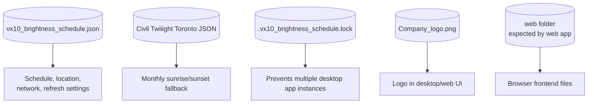

# VX10 Program Architecture

This document explains the architecture of the VX10 brightness control program using Mermaid diagrams.

The current project has two main Python entry points:

- `VX10-brightness -2 (protocol).py`: the main Tkinter desktop app and VX10 protocol/schedule engine.
- `vx10_web_app.py`: a small HTTP server that imports the protocol module and exposes browser/API endpoints.

The shared data/config files are:

- `vx10_brightness_schedule.json`
- `Civil Twilight (Toronto).json`
- `Company_logo.png`

> Note: `vx10_web_app.py` expects a `web/` folder for static browser files, but that folder is not currently present in this repo root.

## 1. High-Level System Architecture



## 2. Main Module Responsibilities



## 3. Desktop App Flow

The desktop app starts from:

```python
if __name__ == "__main__":
    create_gui()
```



## 4. Web App Flow

The web app starts from:

```python
if __name__ == "__main__":
    main()
```

`vx10_web_app.py` dynamically imports the main protocol file:

```python
APP_FILE = BASE_DIR / "VX10-brightness -2 (protocol).py"
```



## 5. Schedule Calculation Flow



## 6. Brightness Command Flow



The protocol flags are:

```python
FLAGS = {
    "TCP": 0x11,
    "UDP": 0x12,
}
```

The frame format is:

```text
0x02 + protocol flag + ASCII command + 0x03 + 0x32
```

## 7. API Endpoints in `vx10_web_app.py`



Endpoint summary:

| Endpoint | Method | Purpose |
| --- | --- | --- |
| `/` | `GET` | Serves `web/index.html` |
| `/api/state` | `GET` | Returns current schedule, sun times, active rule, nits, and network config |
| `/api/brightness?mode=TCP` | `GET` | Reads current VX10 brightness using TCP or UDP |
| `/api/brightness` | `POST` | Sets VX10 brightness from JSON body |
| `/api/color-temp` | `GET` | Reads brightness/color temperature from VX10 HTTP API |
| `/company_logo.png` | `GET` | Serves company logo |

## 8. Important Runtime Files



| File | Used by | Purpose |
| --- | --- | --- |
| `vx10_brightness_schedule.json` | Desktop app and web app | Main schedule, location, network, and refresh configuration |
| `Civil Twilight (Toronto).json` | Protocol module | Monthly sunrise/sunset fallback data |
| `.vx10_brightness_schedule.lock` | Desktop app | Prevents multiple desktop app instances |
| `Company_logo.png` | Desktop/web app | UI branding/logo |
| `web/` | Web app | Static frontend folder expected by `vx10_web_app.py` |

## 9. Summary

The program is built around one shared protocol/schedule module:

```text
VX10-brightness -2 (protocol).py
```

That module handles:

- VX10 TCP/UDP command framing
- brightness reads/writes
- VX10 HTTP color temperature reads
- schedule JSON loading
- sunrise/sunset resolution
- active rule calculation
- nits estimation
- Tkinter desktop UI

The web app:

```text
vx10_web_app.py
```

imports that same module and exposes the same behavior through local HTTP endpoints.
